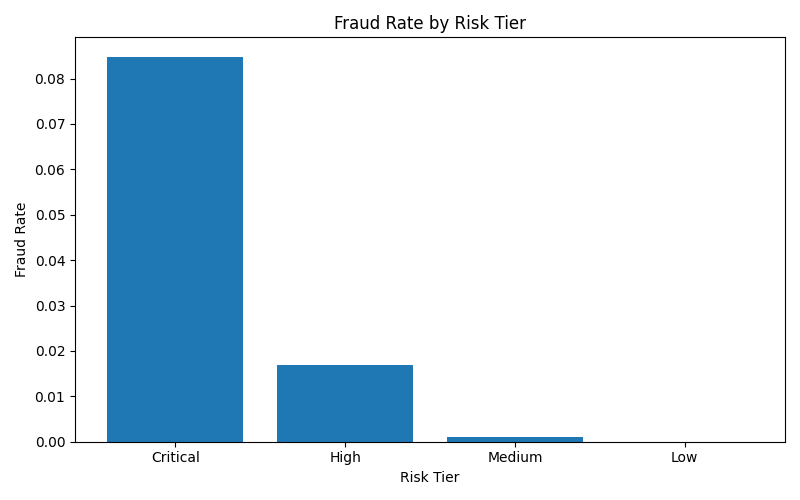
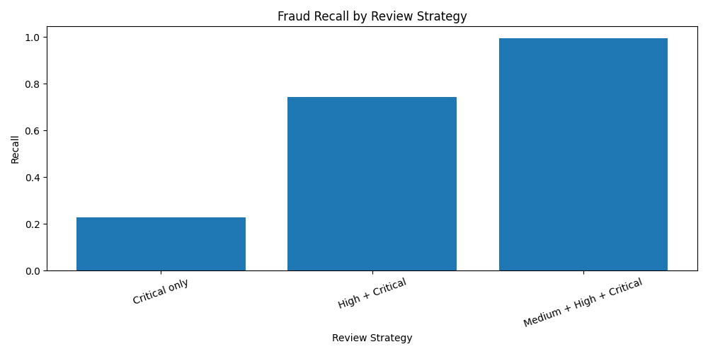
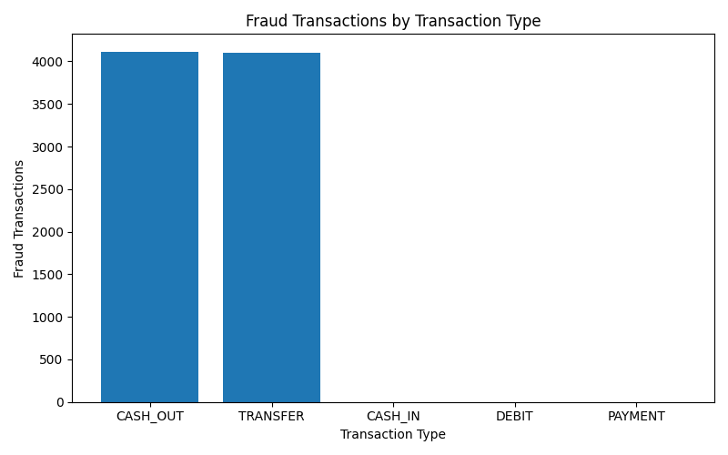

# PaySim Fraud Strategy: Rule Tuning, Risk Scoring & Alert Prioritization

## Project Overview

This project uses SQL, DuckDB, and Python to analyze a public fraud detection dataset and simulate how fraud strategy teams identify fraud patterns, develop detection rules, engineer risk signals, prioritize alerts, and balance fraud detection effectiveness with operational capacity.

Rather than focusing solely on identifying fraudulent transactions, this case study demonstrates how fraud analytics can support real-world operational decision-making through risk scoring and alert prioritization.

---

## Business Problem

Financial institutions process millions of transactions daily, making it impractical to manually review every transaction for fraud.

The objective of this project was to identify fraud patterns within the PaySim dataset and develop a risk-based alert prioritization framework that balances fraud detection effectiveness with investigation workload.

---

## Dataset Overview

* Dataset: PaySim Mobile Money Transactions
* Total Transactions Analyzed: 6,362,620
* Fraud Transactions: 8,213
* Fraud Prevalence: 0.13%

The dataset exhibited a highly imbalanced fraud distribution, reflecting real-world payment environments where fraudulent activity represents only a small fraction of total transaction volume.

---

## Methodology

The project followed an end-to-end fraud analytics workflow:

1. Conducted exploratory data analysis to understand transaction behaviour and fraud distribution.
2. Identified transaction types associated with fraudulent activity.
3. Developed and tested fraud detection rules using SQL.
4. Evaluated rule performance using recall, precision, false positives, and false negatives.
5. Tuned thresholds to improve fraud detection effectiveness.
6. Engineered fraud risk features, including:

   * Risky transaction types
   * High transaction amounts
   * High origin account depletion
   * Destination balance mismatches
7. Built weighted fraud risk scores.
8. Segmented transactions into Low, Medium, High, and Critical risk tiers.
9. Evaluated alert prioritization strategies based on fraud capture and operational workload.

---

## Core Analytics Components

* SQL-based fraud analysis
* Fraud detection rule development
* Threshold tuning
* Recall and precision evaluation
* False positive and false negative analysis
* Fraud feature engineering
* Weighted risk scoring
* Risk tier segmentation
* Alert prioritization and capacity planning
* Business recommendation development

---

## Key Findings

### Fraud Concentration

Fraud activity was concentrated almost entirely within TRANSFER and CASH_OUT transaction types.

### Fraud Rates by Risk Tier

| Risk Tier | Fraud Rate |
| --------- | ---------: |
| Critical  |      8.48% |
| High      |      1.70% |
| Medium    |      0.10% |
| Low       |    0.0008% |

Fraud concentration increased substantially as weighted risk scores increased.

---

## Alert Prioritization Results

| Review Strategy          | Alerts Reviewed | Fraud Caught | Recall | Precision |
| ------------------------ | --------------: | -----------: | -----: | --------: |
| Critical only            |          21,926 |        1,860 | 22.65% |     8.48% |
| High + Critical          |         271,029 |        6,096 | 74.22% |     2.25% |
| Medium + High + Critical |       2,327,004 |        8,180 | 99.60% |     0.35% |

---

## Recommendation

Reviewing High and Critical risk tiers provides the best balance between fraud detection effectiveness and operational efficiency.

This strategy captures approximately 74% of fraudulent transactions while limiting review volume to approximately 271,000 alerts.

Although including Medium-risk alerts increases fraud capture to nearly 100%, it increases review workload more than eightfold while substantially reducing precision.

---

## Skills Demonstrated

* SQL (DuckDB)
* Fraud Analytics
* Fraud Detection Rule Development
* Precision and Recall Analysis
* Threshold Tuning
* Feature Engineering
* Risk Scoring
* Alert Prioritization
* Operational Risk Decision-Making
* Python (pandas)
* Data Analysis and Interpretation

---

## Project Structure

```text
PaySim-Fraud-Analytics/
├── notebooks/
├── sql/
├── outputs/
├── docs/
├── images/
├── README.md
└── requirements.txt
```

---

## Business Impact

This project demonstrates how fraud analytics can move beyond simple rule creation to support strategic decision-making. By combining fraud signals into weighted risk scores and evaluating alert review strategies, the framework illustrates the trade-offs fraud teams face between maximizing fraud detection and maintaining sustainable investigation capacity.

## Key Visualizations

### Fraud Rate by Risk Tier


### Fraud Recall by Review Strategy


### Fraud Transactions by Transaction Type
